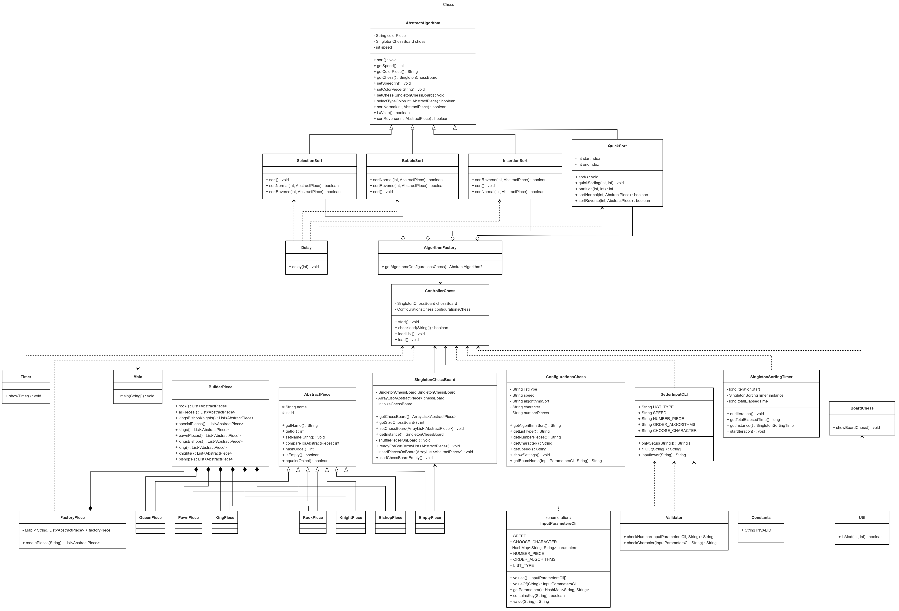
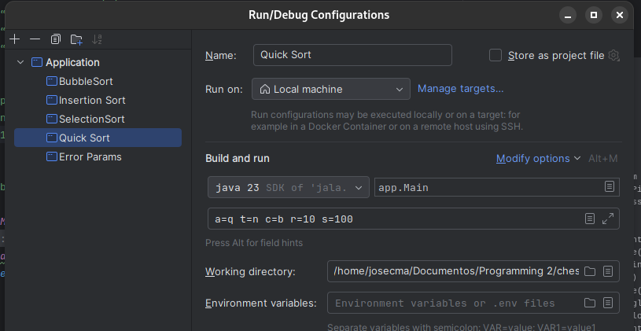
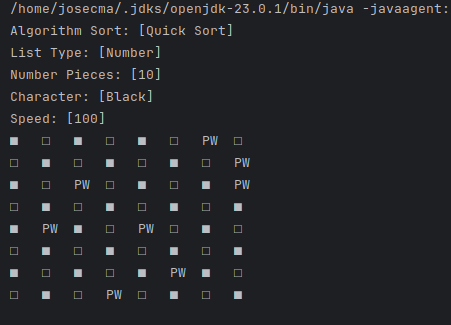
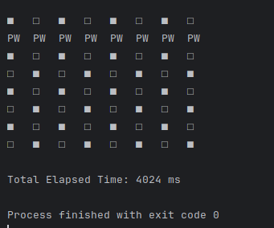

# CHESS Sort
## PARAMETROS VALIDOS PARA LA EJECUCIÓN
```
a --> Algoritmo para el ordenamiento de la piezas
    argumentos validos
    b = BubbleSort
    i = InsertionSort
    q = QuickSort
    s = SelectionSort
t --> Tipo de piezas
    argumentos validos
    n = numero
    c = caracter
c --> Color de las piezas
    argumentos validos
    b = negro
    w = blancas
r --> Cantidad de piezas para colocarlas en el tablero
    argumentos validos
    1 --> “Se coloca al Rey”
    2 --> “Se coloca al Rey y la Reina”
    4 --> “Se coloca los Alfiles, Rey y Reina”
    6 --> “Se coloca los Caballos, Alfiles, Rey y Reina”
    8 --> “Se colocan las Torres, Caballos, Alfiles, Rey y Reina”
    10 --> “Se colocan los peones”
    16 --> “Se colocan todas las piezas”
s --> Tiempo de espera entre el ordenamiento
    argumentos validos
    100 - 1000
Ejemplo:

a=q t=n c=b r=10 s=100
```
## CÓDIGO MERMAID

```mermaid
---
config:
  look: classic
  layout: elk
title: Chess
---
classDiagram
direction BT
    class AbstractAlgorithm {
	    - String colorPiece
	    - SingletonChessBoard chess
	    - int speed
	    + sort() void
	    + getSpeed() int
	    + getColorPiece() String
	    + getChess() SingletonChessBoard
	    + setSpeed(int) void
	    + setColorPiece(String) void
	    + setChess(SingletonChessBoard) void
	    + selectTypeColor(int, AbstractPiece) boolean
	    + sortNormal(int, AbstractPiece) boolean
	    + isWhite() boolean
	    + sortReverse(int, AbstractPiece) boolean
    }
    class AbstractPiece {
	    # String name
	    # int id
	    + getName() String
	    + getId() int
	    + setName(String) void
	    + compareTo(AbstractPiece) int
	    + hashCode() int
	    + isEmpty() boolean
	    + equals(Object) boolean
    }
    class AlgorithmFactory {
	    + getAlgorithm(ConfigurationsChess) AbstractAlgorithm?
    }
    class BishopPiece {
    }
    class BoardChess {
	    + showBoardChess() void
    }
    class BubbleSort {
	    + sortNormal(int, AbstractPiece) boolean
	    + sortReverse(int, AbstractPiece) boolean
	    + sort() void
    }
    class BuilderPiece {
	    + rook() List~AbstractPiece~
	    + allPieces() List~AbstractPiece~
	    + kingsBishopKnights() List~AbstractPiece~
	    + specialPieces() List~AbstractPiece~
	    + kings() List~AbstractPiece~
	    + pawnPieces() List~AbstractPiece~
	    + kingsBishops() List~AbstractPiece~
	    + king() List~AbstractPiece~
	    + knights() List~AbstractPiece~
	    + bishops() List~AbstractPiece~
    }
    class ConfigurationsChess {
	    - String listType
	    - String speed
	    - String algorithmsSort
	    - String character
	    - String numberPieces
	    + getAlgorithmsSort() String
	    + getListType() String
	    + getNumberPieces() String
	    + getCharacter() String
	    + getSpeed() String
	    + showSettings() void
	    + getEnumName(InputParametersCli, String) String
    }
    class Constants {
	    + String INVALID
    }
    class ControllerChess {
	    - SingletonChessBoard chessBoard
	    - ConfigurationsChess configurationsChess
	    + start() void
	    + checkload(String[]) boolean
	    + loadList() void
	    + load() void
    }
    class Delay {
	    + delay(int) void
    }
    class EmptyPiece {
    }
    class FactoryPiece {
	    - Map < String, List~AbstractPiece~ > factoryPiece
	    + createPieces(String) List~AbstractPiece~
    }
    class InputParametersCli {
	    + SPEED
	    + CHOOSE_CHARACTER
	    - HashMap~String, String~ parameters
	    + NUMBER_PIECE
	    + ORDER_ALGORITHMS
	    + LIST_TYPE
	    + values() InputParametersCli[]
	    + valueOf(String) InputParametersCli
	    + getParameters() HashMap~String, String~
	    + containsKey(String) boolean
	    + value(String) String
    }
    class InsertionSort {
	    + sortReverse(int, AbstractPiece) boolean
	    + sort() void
	    + sortNormal(int, AbstractPiece) boolean
    }
    class KingPiece {
    }
    class KnightPiece {
    }
    class Main {
	    + main(String[]) void
    }
    class PawnPiece {
    }
    class QueenPiece {
    }
    class QuickSort {
	    - int startIndex
	    - int endIndex
	    + sort() void
	    + quickSorting(int, int) void
	    + partition(int, int) int
	    + sortNormal(int, AbstractPiece) boolean
	    + sortReverse(int, AbstractPiece) boolean
    }
    class RookPiece {
    }
    class SelectionSort {
	    + sort() void
	    + sortNormal(int, AbstractPiece) boolean
	    + sortReverse(int, AbstractPiece) boolean
    }
    class SetterInputCLI {
	    + String LIST_TYPE
	    + String SPEED
	    + String NUMBER_PIECE
	    + String ORDER_ALGORITHMS
	    + String CHOOSE_CHARACTER
	    + onlySetup(String[]) String[]
	    + fillOut(String[]) String[]
	    + inputlower(String) String
    }
    class SingletonChessBoard {
	    - SingletonChessBoard SingletonChessBoard
	    - ArrayList~AbstractPiece~ chessBoard
	    - int sizeChessBoard
	    + getChessBoard() ArrayList~AbstractPiece~
	    + getSizeChessBoard() int
	    + setChessBoard(ArrayList~AbstractPiece~) void
	    + getInstance() SingletonChessBoard
	    - shufflePiecesOnBoard() void
	    + readyForSort(ArrayList~AbstractPiece~) void
	    - insertPiecesOnBoard(ArrayList~AbstractPiece~) void
	    + loadChessBoardEmpty() void
    }
    class SingletonSortingTimer {
	    - long iterationStart
	    - SingletonSortingTimer instance
	    - long totalElapsedTime
	    + endIteration() void
	    + getTotalElapsedTime() long
	    + getInstance() SingletonSortingTimer
	    + startIteration() void
    }
    class Timer {
	    + showTimer() void
    }
    class Util {
	    + isMod(int, int) boolean
    }
    class Validator {
	    + checkNumber(InputParametersCli, String) String
	    + checkCharacter(InputParametersCli, String) String
    }

 	<<enumeration>> InputParametersCli

    BishopPiece --|> AbstractPiece
    BubbleSort --|> AbstractAlgorithm
    EmptyPiece --|> AbstractPiece
    InsertionSort --|> AbstractAlgorithm
    KingPiece --|> AbstractPiece
    KnightPiece --|> AbstractPiece
    PawnPiece --|> AbstractPiece
    QueenPiece --|> AbstractPiece
    QuickSort --|> AbstractAlgorithm
    RookPiece --|> AbstractPiece
    SelectionSort --|> AbstractAlgorithm
    Delay ..> BubbleSort
    Delay ..> InsertionSort
    Delay ..> QuickSort
    Delay ..> SelectionSort
    Util ..> BoardChess
    Timer ..> ControllerChess
    SingletonSortingTimer ..> ControllerChess
    SetterInputCLI ..>  ControllerChess
    SingletonChessBoard --> ControllerChess
    Main <-- ControllerChess
    ControllerChess  <.. AlgorithmFactory
    Constants ..> SetterInputCLI
    AlgorithmFactory o-- BubbleSort
    AlgorithmFactory o-- InsertionSort
    AlgorithmFactory o-- QuickSort
    AlgorithmFactory o-- SelectionSort
    FactoryPiece *-- BuilderPiece
    RookPiece --* BuilderPiece
    KingPiece --* BuilderPiece
    KnightPiece --* BuilderPiece
    PawnPiece --* BuilderPiece
    QueenPiece --* BuilderPiece
    BishopPiece --* BuilderPiece
    Validator ..> SetterInputCLI
    BoardChess ..> ControllerChess
    ConfigurationsChess -->  ControllerChess
    InputParametersCli ..> SetterInputCLI
    FactoryPiece ..> ControllerChess
    EmptyPiece --> SingletonChessBoard
```

## DIAGRAMA DE CLASES


## EJECUCIÓN

### PARAMETROS DE EJECUCIÓN

### EJECUCIÓN



# AUTOR

Jose Carlos Medina Averanga
